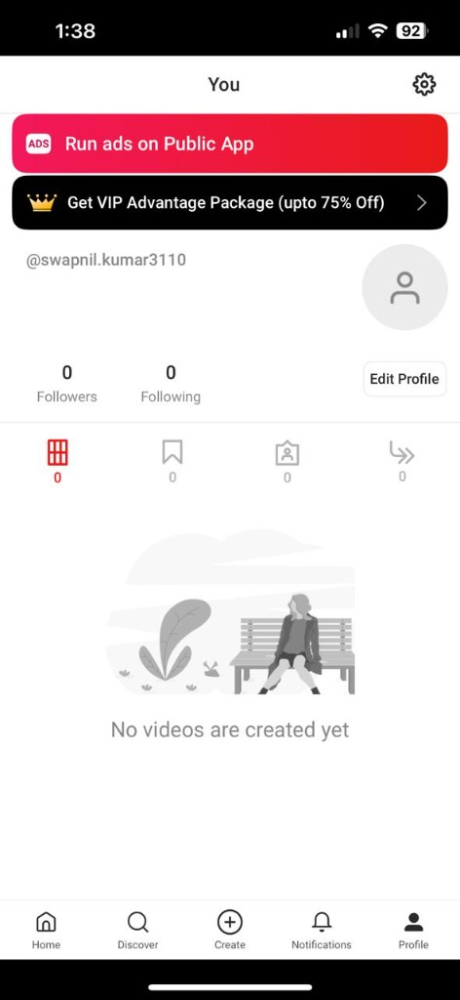
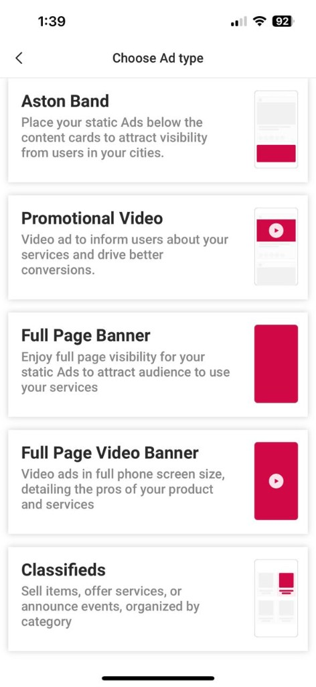
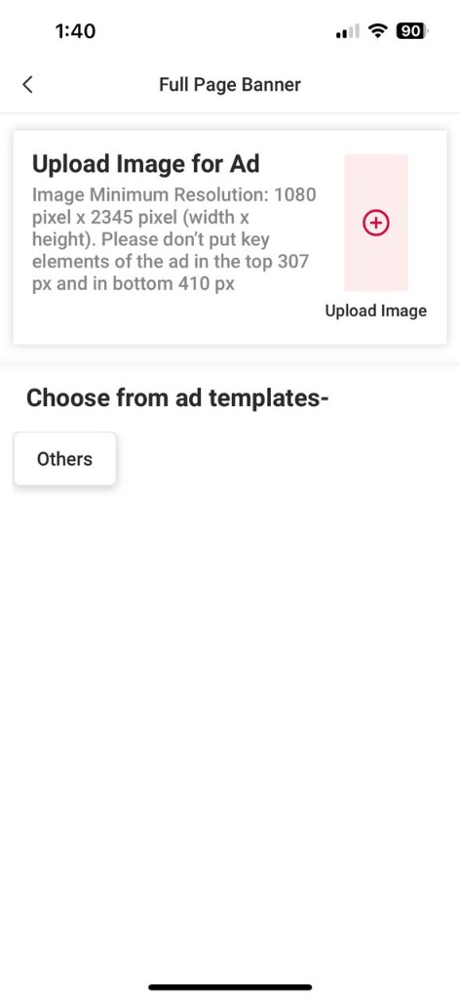
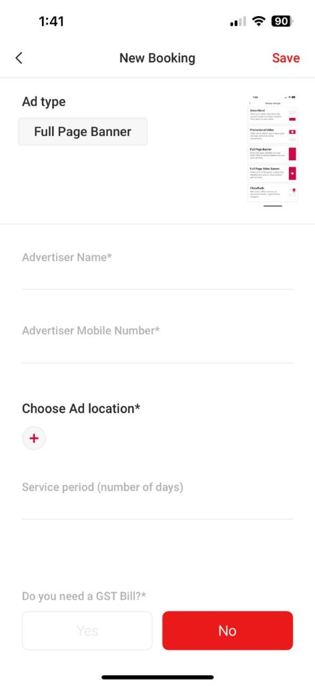
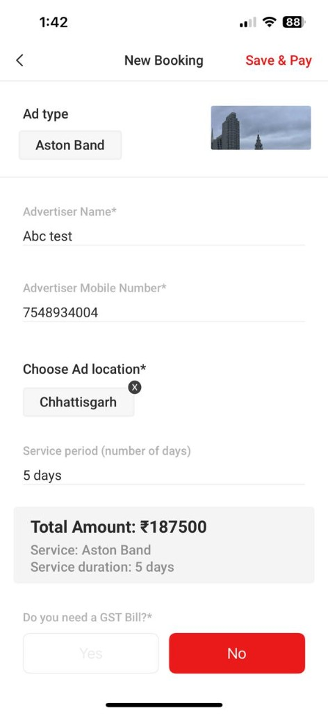
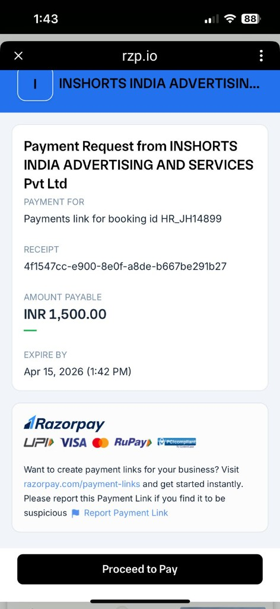
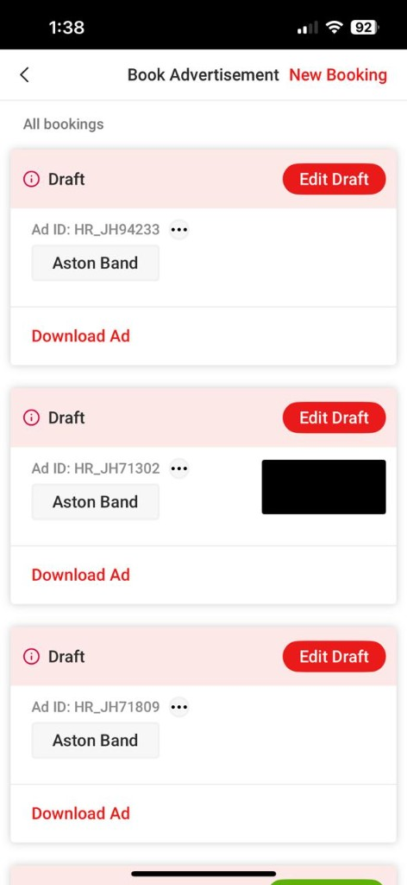
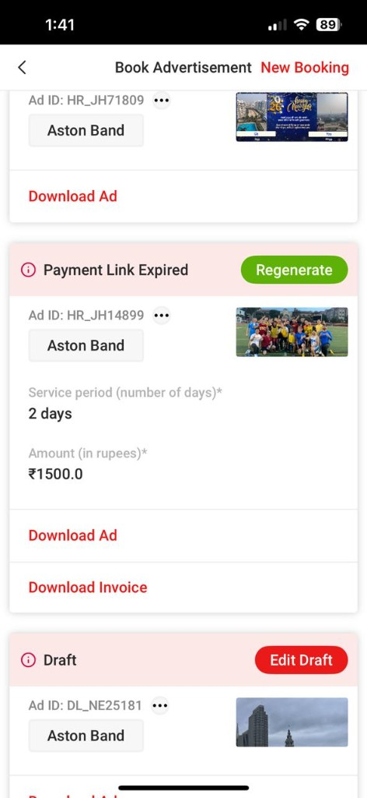

# Launching a User-Generated Ads Platform for 100M Users

**Company:** Inshorts ($550M Digital Media Platform)
**Role:** Product Manager, Public App
**Timeline:** Apr 2023 – Jun 2024

---

## The Problem

Inshorts' short-video news app had over **100M users** — predominantly in tier 2 and tier 3 cities across India. The app was entirely ad-revenue driven, yet we were sourcing ads from only news reporters, who made up **less than 0.5% of our user base**.

The mandate was clear: *grow revenue without growing costs.*

Relying on a fraction of users to generate all ad supply wasn't scalable. The ceiling was low, and we were approaching it fast.

---

## The Insight

The answer came from an unexpected place — the local newspaper.

In tier 2 and tier 3 cities across India, local newspapers routinely dedicate 2 full pages to community ads — birthdays, anniversaries, obituaries, local events. It's not a niche behavior; it's deeply embedded in how people in these cities celebrate and communicate publicly with their community.

Our 100M users were already living this behavior offline. We just hadn't given them a platform to do it digitally. The opportunity was to bring this habit online — and monetize it.

---

## The Approach

The project had three parallel workstreams: **UX & product design**, **pricing & payments**, and **go-to-market**.

---

### 1. End-to-End Ad Creation & Management UX

#### Entry Point

The feature was surfaced directly on the user's profile page — a prominent "Run ads on Public App" banner, making discovery frictionless for any user.

#### Choosing an Ad Format

Users could choose from 5 ad formats depending on their use case:
- **Aston Band** — static ad placed below content cards
- **Promotional Video** — video ad for better conversions
- **Full Page Banner** — full-screen static visibility
- **Full Page Video Banner** — full-screen video ad
- **Classifieds** — sell items, offer services, announce events

This range ensured the platform served everyone from a local shop owner to someone posting an anniversary shoutout.

#### Creating the Ad Creative

For each format, users could either upload their own image or choose from pre-built templates. The north star was **simplicity** — reducing the number of steps for a first-time user in a small town to publish their first ad.

Custom templates pre-filled structure for the most common use cases, so users only had to add a photo and a message.

#### Booking Details

Once the creative was ready, users filled in the booking details: advertiser name, mobile number, target location (by state/city), and service duration in days.

#### Pricing & Payment

Before paying, users saw a clear pricing summary — total amount calculated based on ad type, location, and duration. For example: Aston Band, Chhattisgarh, 5 days = ₹1,87,500.

Users could also request a GST bill, making the platform usable for small businesses.

Tapping "Save & Pay" triggered a **Razorpay payment link** — supporting UPI, Visa, Mastercard, and RuPay — making it accessible to the full breadth of our tier 2/3 user base.

#### Campaign Management Dashboard

After booking, users had full visibility into their campaigns — active, draft, and expired — along with options to download the ad creative and invoice.

The dashboard also handled edge cases gracefully — for example, surfacing a **"Regenerate"** CTA when a payment link expired, rather than requiring the user to restart from scratch.

---

### 2. Payment Integration & Pricing Strategy

Worked with the engineering team to **extend the existing payment gateway** — which previously served only reporters — to the full user base, and wired it into the new ad booking workflow.

For pricing, I researched two benchmarks:
- What local newspapers charge for equivalent ad real estate
- What competitor digital platforms were pricing similar inventory at

Landed on a simple **two-variable pricing model**:
- **Number of days** the ad runs
- **Target region** (state/city level)

Got alignment with senior leadership and integrated it directly into the payment flow, with GST billing support for business advertisers.

---

### 3. Go-to-Market Strategy

Since this was a fully in-app feature, our distribution advantage was significant — no external acquisition spend needed.

**GTM approach:**
- **In-app promotions** in news feed and discover feed to drive awareness
- Reused existing creative templates for promotional banners — near-zero production cost
- **Staged rollout** — [0.1% → 0.5% → 1% → 10% → 100%] to catch and contain issues before full launch, with metrics gates at each stage

---

## Impact

- Scaled to **10M+ DAU** across Android, iOS, and web
- Opened ads supply from 0.5% (reporters only) to **100% of the user base**
- Drove incremental ad revenue with **no additional acquisition cost**

---

## Skills & Tools

Product Strategy, 0-to-1 Product, UX Design, User Flows, Pricing Strategy, Payment Integration, A/B Testing, Staged Rollout, Growth, Ads Platform, Figma, Android & iOS, Cross-functional Leadership
