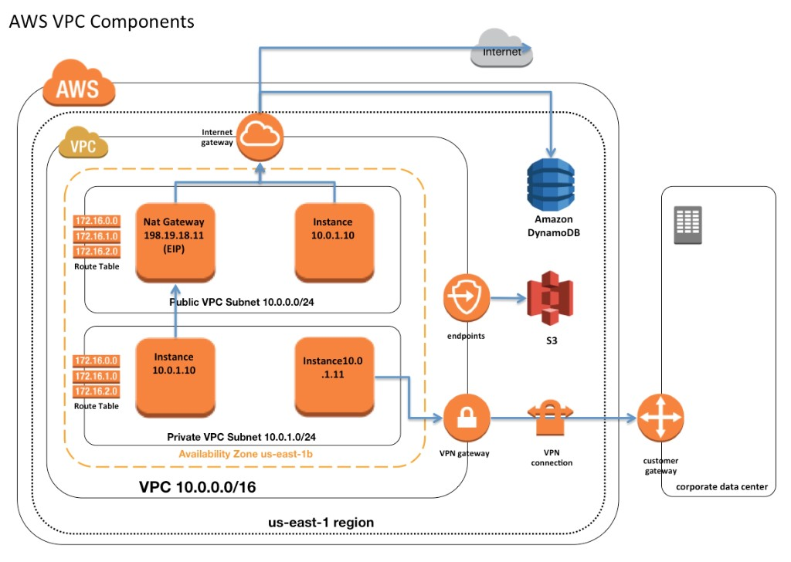
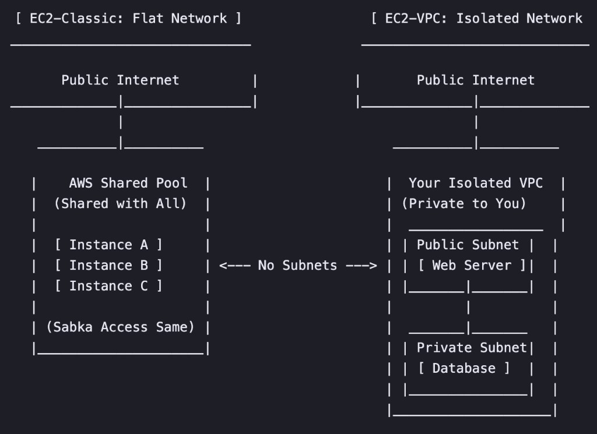

# AWS Networking — Overview

#### TL;DR

AWS offers over 20 networking services (Lattice, PrivateLink, VPC Peering, Transit Gateway, NAT Gateway, etc.) alongside fundamental building blocks like VPCs, Subnets, Route Tables, and NACLs. While this vast ecosystem addresses virtually every networking use case for building, launching, and scaling applications, it comes with a steep learning curve.

This complexity is especially challenging for early-to-growth-stage startups that typically lack dedicated cloud infrastructure teams. My project aimed to solve this by simplifying how startups build, manage, and scale their network infrastructure on AWS.

---

#### My Role in the EC2 Networking Team

During my time at AWS, I was part of the EC2 Networking team.

To put networking into perspective: applications rely on various AWS services — compute (EC2, ECS, Lambda), storage (RDS, S3), and AI/ML capabilities (Bedrock, SageMaker). For these resources to function, interact with each other, and serve customers securely over the internet, they need a secure, private cloud network. The EC2 Networking team owns and builds the services that solve these exact use cases, including VPCs and connectivity services like Peering, Cloud WAN, Transit Gateway (TGW), NAT Gateway, PrivateLink, and Lattice.

---

#### The Evolution of the AWS Private Network

To understand the current complexity, it helps to look at how AWS networking evolved.

**EC2-Classic — The Original Architecture**

Originally, AWS used a flat network architecture. When you launched an instance, it simply landed on this flat network, allowing services to connect easily. However, while simple, it lacked advanced networking controls, isolation, and security.

**Amazon Virtual Private Cloud (VPC)**

To address these limitations, AWS launched the VPC. A VPC is a logically isolated section of the AWS Cloud where you can launch resources in a virtual network that you define. It functions like a private data center in the cloud, giving you complete control over your networking environment, including IP address ranges, subnets, and network gateways.

**EC2-Classic vs. VPC**

- **Isolation:** EC2-Classic instances shared a network with other customers. VPC instances run in a logically isolated network specific to your AWS account.
- **IP Addressing:** In EC2-Classic, private IP addresses could change every time an instance restarted. VPC introduced static private IP addresses that persist across stops and starts.
- **Security:** EC2-Classic only supported inbound rules. VPC introduced Security Groups with both inbound and outbound (egress) filtering.

---

#### The Cost of Control: Exponential Complexity

While VPCs provided necessary control and isolation, they also introduced highly complex connectivity scenarios. Users now needed to figure out how to route traffic for:

- VPC ↔ Internet
- VPC ↔ VPC (across the same/different regions, accounts, or organizations)
- VPC ↔ On-premises or other private networks (like GCP)
- VPC ↔ External AWS services (like S3)

To address these scenarios at any imaginable scale, AWS built a massive portfolio of 20+ networking services and specific building blocks.

---

#### The Problem & My Project Scope

AWS guarantees that whatever your use case or scale, they have the tools to solve it. However, the trade-off is a massive learning curve. Users must deeply understand raw building blocks and complex services to get started.

For early-to-growth-stage startups without dedicated cloud infrastructure experts, this becomes a major bottleneck.

**My project:** simplify how startups build, manage, and scale their network infrastructure on AWS.

- **In scope:** Simplifying the foundational building and scaling of network architecture
- **Out of scope:** Observability and deep security configurations

---

*Continue reading:*
- [Networking Growth Research](../networking-growth-research/) — How we built the business case and scoped a $200M opportunity
- [Agentic AI Private Network](../agentic-ai-private-network/) — The solution we designed
