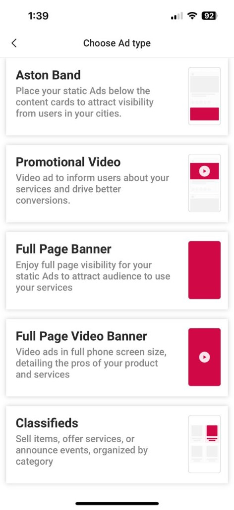
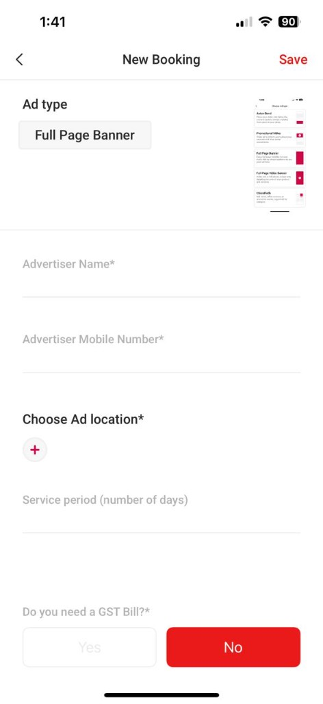

# Internal Ad Tooling

**Company:** Inshorts ($550M Digital Media Platform)  
**Role:** Product Manager, Public App  
**Timeline:** Apr 2023 – Jun 2024

---

<h2 class="article-h2-compact" id="overview">Overview</h2>

On the feed we typically showed **one ad against three content cards**. Behind that simple surface was a full stack for **distribution**, **measurement**, and **analytics** — wired through internal tooling and synced into the app.

<figure class="internal-ad-tooling-figure">
  
  <figcaption><strong>Consumer-facing formats.</strong> The product explained each unit with a simple phone mockup — e.g. Aston Band sits <strong>below the content cards</strong>, while in-feed video sits among the cards. That matched how we reasoned about slots when building distribution and measurement.</figcaption>
</figure>

---

<h2 class="article-h2-compact" id="distribution-geographic-inventory-and-precedence">Distribution: geographic inventory and precedence</h2>

**Inventory** was defined along four geographic tiers: **nation → state → district → sub-district**. At ad-creation time, the advertiser chose **visibility** (which tier the ad applied to). **Pricing reflected that scope** — broader reach cost more.

**Precedence when deciding what to show** followed the same hierarchy: **nation > state > district > sub-district**.

For a given slice of inventory (say, a **sub-district**), we took every ad that could apply there and **ranked the pool in tier order**: national-eligible ads first, then state, then district, then sub-district. That was the core **delivery logic**.

<figure class="internal-ad-tooling-figure">
  
  <figcaption><strong>Internal booking — location and campaign inputs.</strong> Ops captured <strong>ad type</strong>, advertiser details, and <strong>geographic scope</strong> via “Choose Ad location” (the tiers that drive the inventory pool). <strong>Service period</strong> and billing flags sat alongside — the inputs that fed targeting, pacing, and downstream impression accounting.</figcaption>
</figure>

---

<h2 class="article-h2-compact" id="how-the-supply-pool-changed-with-user-generated-ads">How the supply pool changed with user-generated ads</h2>

Before user-generated ads (UGA), **impression tracking was less critical**: supply was limited and we could **reuse the same ads across sessions** without tight caps.

With UGA we **sold on target impressions**, so **managing inventory by impression count became new work**. At any moment, **available ad inventory for a given geography** (say, a **district**) was the union of:

- **Brand ads** at **national** scope (eligible everywhere they were meant to run).  
- **Reporter ads**, **ordered by visibility** (how narrowly or broadly they were targeted).  
- **User-generated ads**, **ordered by visibility**, and only while their **impression target was not yet reached**.

When a UGA line item **hit its impression cap**, we **dropped it from the pool** so we did not keep serving or charging past what was sold.

---

<h2 class="article-h2-compact" id="measurement">Measurement</h2>

**What we counted**

- **Impressions first** — the main signal for delivery and, for UGA, for **staying within sold volume**.

**How we validated**

- For lines running through **Google Ad Manager**, we could attach **external impression trackers** so teams could **check our counts** against third-party reporting.

**What we deferred**

- **Click tracking** was planned as a **follow-on**; we **did not ship** it in this phase.

**What we showed alongside ads**

- Where the product needed it, we paired ad performance with **user demographics** and **growth** metrics for context.

---

<h2 class="article-h2-compact" id="analytics-and-internal-tooling">Analytics and internal tooling</h2>

We already had **impressions at the content-card level**. We **reused that** by storing which **ad creative** sat in which slot — **content card ↔ creative ID** — so every impression **rolled up to the right campaign**.

That fed an **internal tool** where ops and finance managed **campaign details**: creatives, IDs, **tax / billing**, and the rest. **The app read from the same records** (updated on a schedule), so what users saw **matched what the tool said was live**.

To **keep API cost down**, we **refreshed that data every six hours** instead of on every request.

---

<h2 class="article-h2-compact" id="impact">Impact</h2>

- Served **2.4B monthly ad impressions** across Android and iOS  
- Supported **brand, reporter, and user-generated** supply on one distribution and measurement stack  

---

<h2 class="article-h2-compact" id="skills--tools">Skills &amp; tools</h2>

Ads infrastructure, geographic targeting & inventory, impression measurement, campaign tooling, mobile (Android & iOS), scalability, Google Ad Manager, API-efficient sync patterns.
