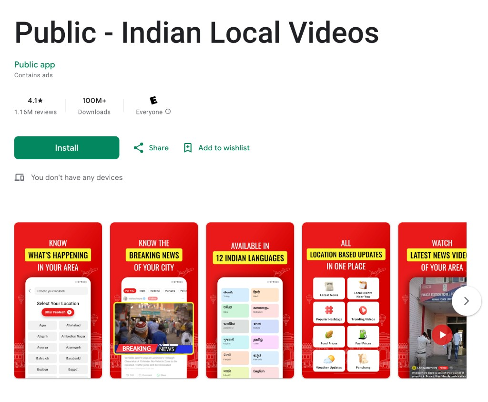
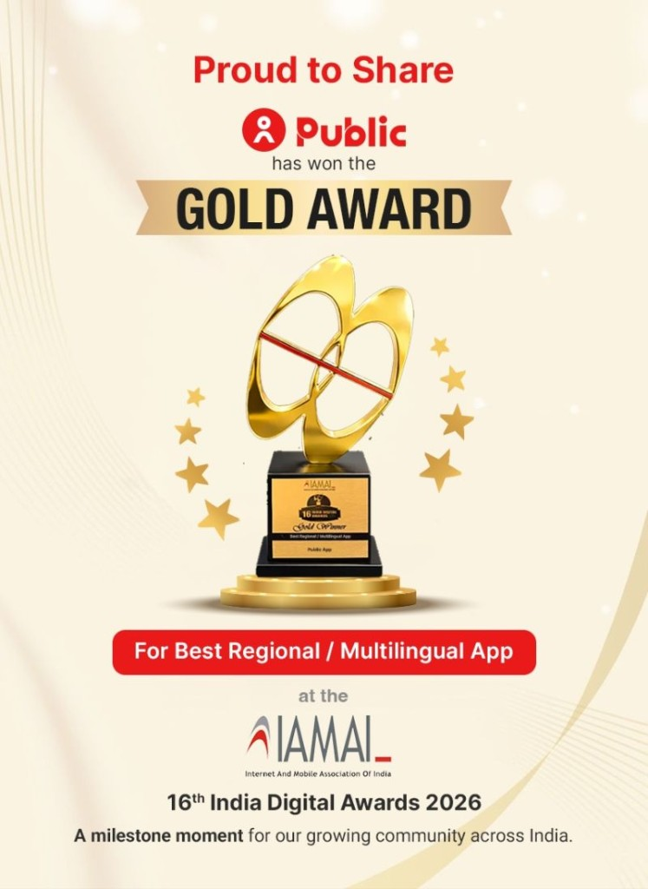

# Inshorts & Public App

**Company:** Inshorts ($550M digital media)  
**Product:** Public App — multilingual, location-based short-video news  
**Role:** Product Manager, Public App  
**Timeline:** Apr 2023 – Jun 2024  
**Location:** Delhi NCR, India

---

## Company & app

**Inshorts** operates one of India’s largest short-form news surfaces: a location-aware, video-first experience aimed especially at users in **tier 2 and tier 3** cities. The product combines local relevance with scale — on the order of **100M+ users**. **Revenue is entirely ads-based**; there is no separate subscription or paywall funding the consumer app.

**Public App** is the consumer-facing surface where that experience ships: multilingual feeds, geo-targeted stories, and the systems that let editorial, creators, and advertisers coexist on one platform. “Multilingual” here is not a side feature; it is core to how content is produced, reviewed, and monetized across regions and languages.

### Public App — store listing & recognition

*Google Play — **100M+** installs, strong review volume, hyper-local and multilingual positioning, and an explicitly ad-funded model (“Contains ads”).*

***Gold Award**, **Best Regional / Multilingual App** — [IAMAI](https://www.iamai.in/) **16th India Digital Awards** (Internet and Mobile Association of India).*

---

## What I owned

I led product for **Public App** end to end: **revenue**, **growth**, and **monetization**, working with engineering, design, editorial, ops, and GTM. That included roadmap and prioritization across the **multilingual content stack** (how stories are created, localized, and surfaced) and the **ads and tooling** that fund the business.

---

## Highlights from this chapter

- **~$17M** in annual ads revenue tied to initiatives I drove on the app  
- **~65%** reduction in operational cost in areas where we automated or streamlined workflows

*(Use the project pages below for story-level detail.)*

---

## Project deep dives

| Topic | Link |
| --- | --- |
| User-generated ads (supply from full user base) | [User Generated Ads Platform](../user-generated-ads-platform/) |
| Internal ad delivery & scale | [Internal Ad Tooling](../internal-ad-tooling/) |
| Web growth & SEO | [Web Growth & Monetization](../web-growth-monetization/) |
| Content review & AI-assisted ops | [Content Review Workflow](../content-review-workflow/) |

---

## Skills & tools (this role)

Product strategy, roadmap & prioritization, multilingual / local-first products, ads monetization, growth, cross-functional leadership (engineering, design, editorial, ops, finance)
